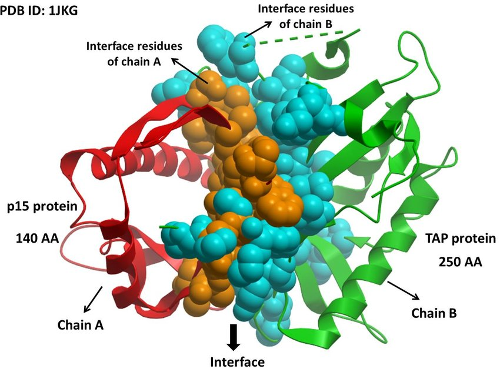

# Protein-protein-interaction - Link Prediction

Project for the Data Science Honors programme 2021-2022

The aim of the project is Link prediction on proteins interaction based on Graph Neural Network

Dataset is a graph containing everything known about protein-protein interaction in humans, the link is [BIOGRID ORGAMISM](https://downloads.thebiogrid.org/BioGRID/Release-Archive/BIOGRID-4.4.208/

Graph nodes have no features, we have just the edges between proteins which interactions is known. Node features are extracted in various way: Node2vec and with SEAL framework, which construct the node information matrix X for each enclosing subgraph.

Then various GNNs architecture are implemented for link prediction:
* GAE (graph auto-encoders)
* DeepGAE (deep graph auto-encoders)
* VGAE (variational graph auto-encoder)
* ARGAE (adversarially regularized graph auto-encoder)
* ARGVAE (adversarially regularized variational graph auto-encoder)  

For GAE and VGAE both a simple inner product decoder than a more complex linear decoder is implemented.

"runs" folders contain tensorboard files for comparing losses, average precisions and AUC of each GNN architecture.

\
\
\

 

